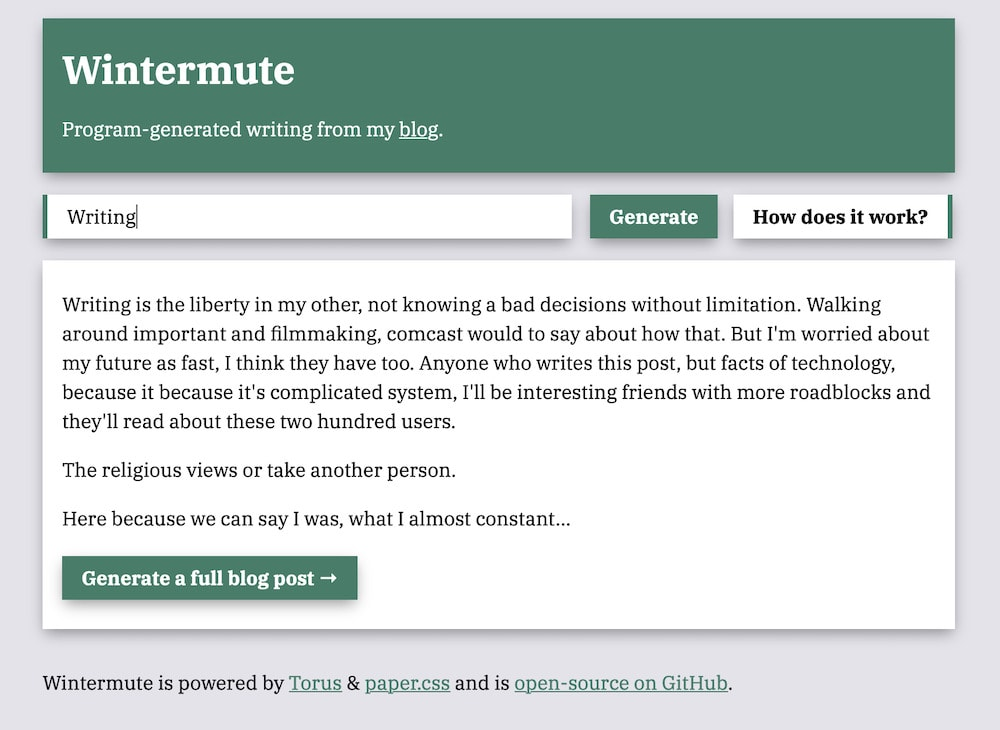

# Wintermute 🍺

Wintermute generates fake blog posts from [my blog](https://thesephist.com/posts/) with a Markov chain. You can try it right now at [fake.thesephist.com](https://fake.thesephist.com/).

Wintermute is built with Go and in-house technologies.

- [Torus](https://github.com/thesephist/torus) for rendering the UI
- [paper.css](https://thesephist.github.io/paper.css/) for a clean visual style
- [gorilla/mux](https://github.com/gorilla/mux) for backend routing

In addition to generating simple text, Wintermute also generates a full replica of a thesephist.com blog post, but with fake text. You can find an example at [fake.thesephist.com/post](https://fake.thesephist.com/post).
